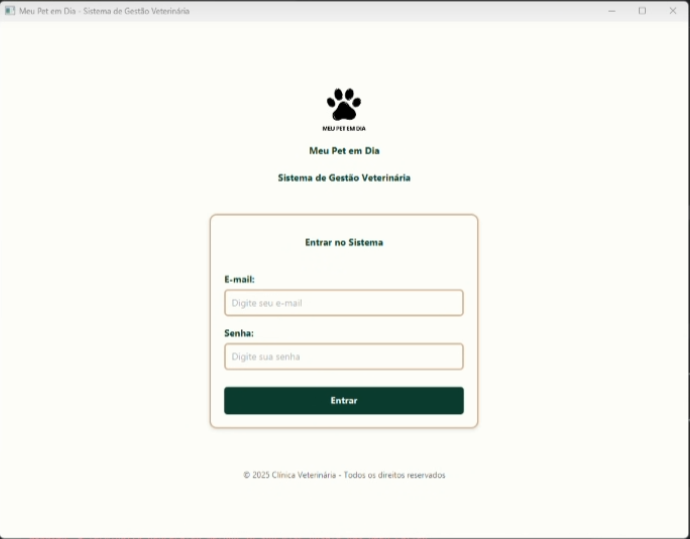
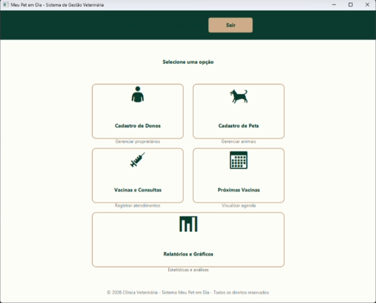
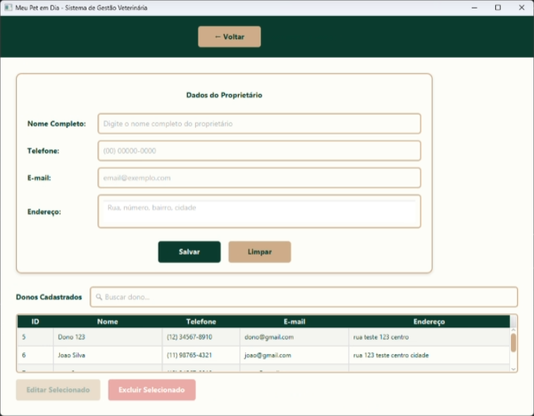
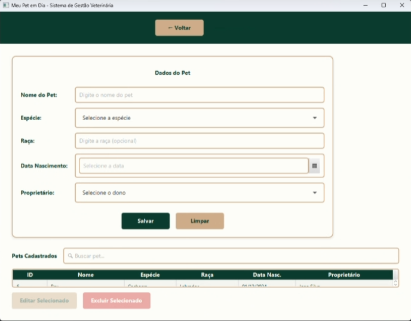
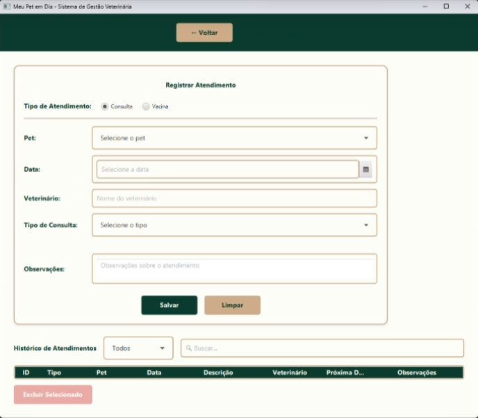
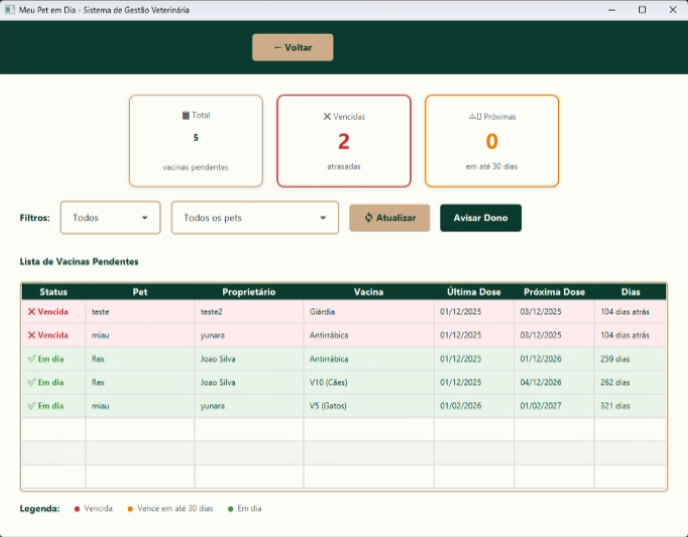
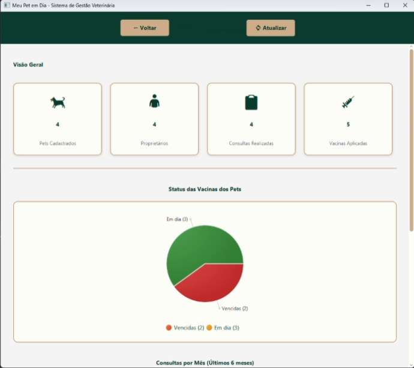
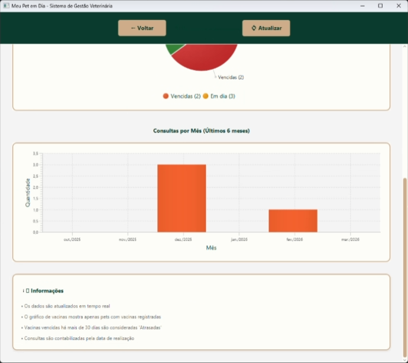

# Estrutura do Projeto

``````text
MeuPetEmDia/
├── pom.xml
├── src/
│   └── main/
│       ├── java/
│       │   └── clinicaveterinaria/meupetemdia/
│       │       ├── Main.java
│       │       │
│       │       ├── config/
│       │       │   └── DatabaseConfig.java
│       │       │
│       │       ├── controller/
│       │       │   ├── LoginController.java
│       │       │   ├── MenuPrincipalController.java
│       │       │   ├── CadastroDonosController.java
│       │       │   ├── CadastroPetsController.java
│       │       │   ├── CadastroVacinasConsultasController.java
│       │       │   ├── ProximasVacinasController.java
│       │       │   └── RelatoriosController.java
│       │       │
│       │       ├── model/
│       │       │   ├── Dono.java
│       │       │   ├── Pet.java
│       │       │   ├── Vacina.java
│       │       │   ├── Consulta.java
│       │       │   └── RegistroVacina.java
│       │       │
│       │       ├── dao/
│       │       │   ├── DonoDAO.java
│       │       │   ├── PetDAO.java
│       │       │   ├── VacinaDAO.java
│       │       │   ├── ConsultaDAO.java
│       │       │   └── RegistroVacinaDAO.java
│       │       │
│       │       ├── service/
│       │       │   └── AuthService.java
│       │       │
│       │       └── util/
│       │           └── NavigationUtil.java
│       │
│       └── resources/
│           ├── clinicaveterinaria/meupetemdia/view/
│           │   ├── login.fxml
│           │   ├── menuPrincipal.fxml
│           │   ├── cadastroDonos.fxml
│           │   ├── cadastroPets.fxml
│           │   ├── cadastroVacinasConsultas.fxml
│           │   ├── proximasVacinas.fxml
│           │   └── relatorios.fxml
│           │
│           └── css/
│               └── style.css
│
└── meupetemdia.db (criado automaticamente)
``````
---

## 🎯 Funcionalidades

### 🔐 Autenticação
- Sistema de login de usuários
- Validação de credenciais
- Controle de acesso às funcionalidades do sistema

### 👤 Gestão de Donos
- Cadastro de donos de pets
- Edição e atualização de dados
- Listagem de proprietários

### 🐶 Gestão de Pets
- Cadastro de pets vinculados aos donos
- Controle de informações do animal
- Relacionamento entre dono e pet

### 💉 Vacinas e Consultas
- Cadastro de vacinas
- Registro de aplicação de vacinas
- Agendamento e controle de consultas veterinárias

### ⏰ Controle de Vacinação
- Visualização de próximas vacinas
- Acompanhamento do calendário de vacinação
- Organização preventiva da saúde dos pets

### 📊 Relatórios
- Geração de relatórios do sistema
- Visualização de dados cadastrados
- Apoio à gestão da clínica

### 🗄️ Persistência de Dados
- Armazenamento em banco de dados SQLite
- Criação automática do banco (`meupetemdia.db`)
- Operações CRUD utilizando padrão DAO

### 🧱 Arquitetura
- Estrutura baseada em MVC (Model-View-Controller)
- Separação em camadas: Controller, Service, DAO, Model
- Navegação entre telas com JavaFX (FXML)
- Estilização com CSS

---

## 🖥️ Telas do sistema

<p align="center">
  
  
  
  
  
  
  
  
  
</p>

---